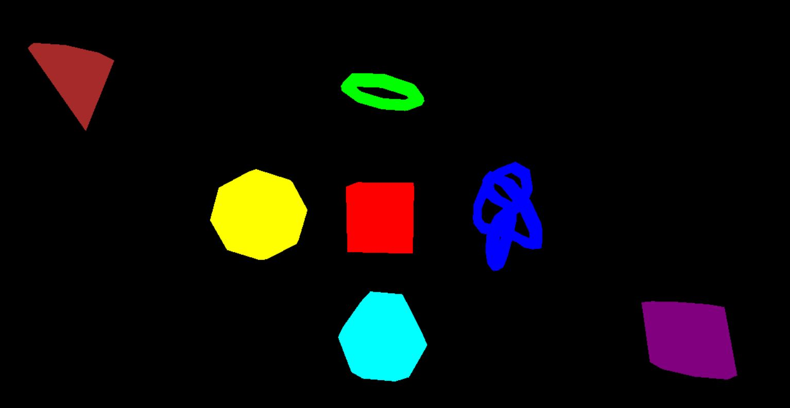

# Three.js-Homework
Introductory homework assignment for Three.js in CMPM 35 at UCSC.

I took the shapes program and edited it to add 2 more shapes, a cone and a cylinder.

Both the cone and the cylinder are also animated, briefly moving up and down respectively

when you first launch the program.

Picture of the code after it is finished:

